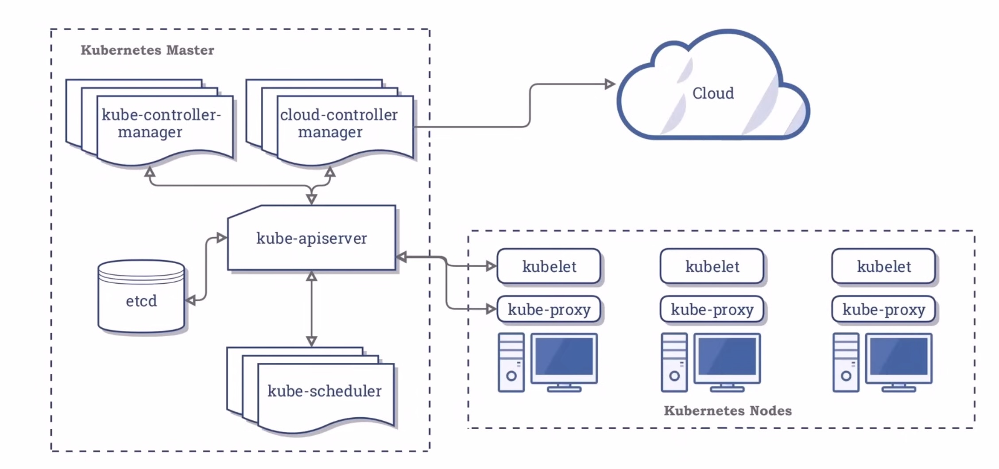
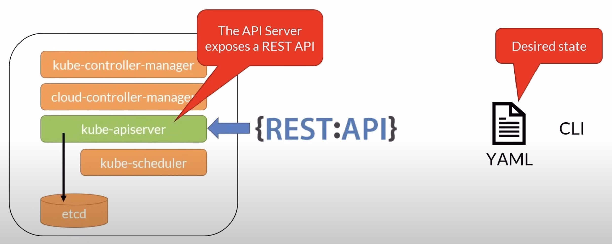

# Kubernetes a.k.a. K8s Concepts

### What is Kubernetes?

- K&s is the leading container orchestration tool
- Designed as a loosely coupled collection of components centered around deploying, maintaining and scaling workloads
- Vendor-neutral : Runs on all cloud providers
- Backed by a huge community

### What K&s can do

- Service discovery and load balancing
- Storage orchestration : Local or Cloud based
- Automated rollouts and rollbacks
- Self-healing
- Secret and configuration management
- Use the same API across on-premise and every cloud providers

### What K&s can't do

- Does not deploy source code
- Does not build your application
- Does not provide application-level services : Message buses, databases, caches, etc

### K&s Architecture



```
 --------------------
|  Cluster           |
|  ---------------   |
| |  Node         |  |
| |  ---------    |  |
| | |  Pod    |   |  |
| |  ---------    |  |
|  ---------------   |
 --------------------
```

## Local K8s

### Docker Desktop

- Requires virtualization
  - Docker Desktop
  - MicroK8s
  - Minikube
- Runs over Docker Desktop
  - Kind
- Limited to 1 node
  - Docker Desktop
- Multiple nodes
  - MicroK8s
  - Kind
  - Minikube

### Windows

- Docker Desktop is currently the only way to run both Linux and Windows containers
- Docker Desktop can run on Hyper-V or WSL 2 (Win 10 2004)
- If Hyper-V is enabled, you can't run another hypervisor at the same time
- You can install Minikube on Hyper-V or VirtualBox

### Minikube

- Does not require Docker Desktop
- Installs on Linux, macOS and Windows
  - https://kubernetes.io/docs/tasks/tools/install-minikube/
- An Hypervisor like VirtualBox is required
- install using brew in macOS

### Test Kubernetes Locally

```bash
kubectl cluster-info
```

## K8s CLI & Context

### K8s API



- Kubernetes API server is a service running on the master node.
- It exposes a rest API that is the only point of communication for kubernetes clusters
- We define the desired state in yaml files
- Let's say we want to run `X` number of instances of a container in the cluster
- We then send that desired state to the cluster via the rest API
- Other applications like a web dashboard can also communicate with the rest API to display the cluster state

### K8s CLI

- `kubectl` is the CLI to interact with the cluster
- Communicates with the apiserver
- Configuration stored locally
    ```
    ${HOME}/.kube/config
    C:\Users\{USER}\.kube\config
    ```

### K8s Context

- A context is a group of access parameters to a K8s cluster
- Contains a Kubernetes cluster, a user, and a namespace
- The current context is the cluster that is currently the default for kubectl
  - All kubectl commands run against that cluster


### `kubectl` - Context Cheat Sheet

```bash
kubectl config current-context               # Get the current context
kubectl config get-contexts                  # List all context
kubectl config use-context [contextName]     # Change/Set the current context
kubectl config delete-context [contextName]  # Delete a context from the config file
```

### `kubectx` - Quickly swithc context

- Instead of typing `kubectl config use-context minikube`
- Simply type `kubectx [contextName]`
- macOS `brew install kubectx`
- Ubuntu `sudo apt install kubectx` (https://github.com/ahmetb/kubect)

## 2 ways to create resources

The declarative way vs the imperative way

### Imperative

- Using kubectl commands, issue a series of commands to create resources
- Great for learning, testing and troubleshooting
- It's like code

### Declarative
  
- Using kubectl and YAML manifests defining the resources that you need
- Reproducible, repeatable
- Can be saved in source control
- It's like data that can be parsed and modified

What's a YAML file?

- It's a text file that contains properties that define the resource
- It has some required properties like the API version the object kind that defines the type of object you want to create
- Root level required properties
  - apiVersion
    - Api version of the object
  - kind
    - type of object
  - metadata.name
    - unique name for the object
  - metadata.namespace
    - scoped environment name (will default to current)
  - spec
    - object specifications or desired state
- You can use the `kubectl create` command to send the information to the kubernetes cluster
  ```bash
  kubectl create -f [YAML file]
  ```

Declarative vs Imperative example : [L18-04](https://github.com/K8sAcademy/Fundamentals-HandsOn/blob/main/L18-04%20Declarative%20vs%20Imperative/Readme.md)

