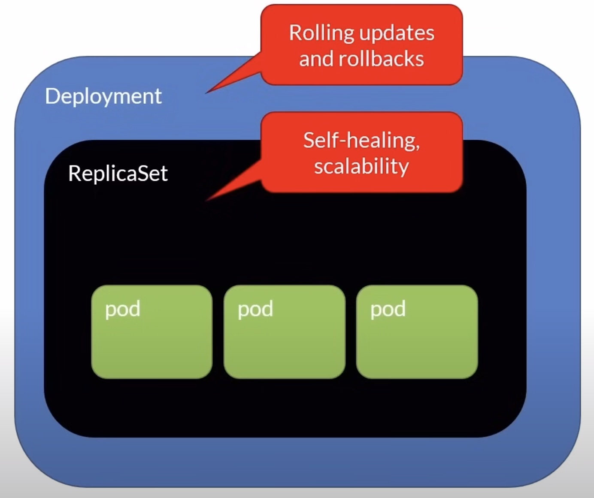

# Workloads

A workload is an application running on Kubernetes

- Pod : Represents a set of running containers
- ReplicaSet
- Deployment
- StatefulSet
- DeamonSet : Provide node-local facilities, such as a storage driver or network plugin
- Tasks that run to completion : Job, CronJob

## ReplicaSets

- Primary method of managing pod replicas and their lifecycle to provide self-healing capabilities
- Their job is to always ensure the desired number of pods are running
- While you can create ReplicaSets, the recommended way is to create Deployments

**Self-healing :** : If a pod fails, the ReplicaSet will create a new pod to replace it

**ReplicaSet vs Deployment :** While you can create ReplicaSets, the recommended way is to create Deployments because they provide extra functionalities on top of ReplicaSets. So why bother and learn about ReplicaSets? Well, in the Deployment lecture, you'll see that when you create a Deployment, that will also create a ReplicaSet in the background. That's why it's important to learn about the ReplicaSet's functionalities.

## kubectl - ReplicaSets Cheat Sheet

```bash
# Create a ReplicaSet
kubectl apply -f 013_workloads/replicaset-definition.yaml

# List ReplicaSets
kubectl get rs

# Get info
kubectl describe rs myapp-replicaset

# Delete a ReplicaSet
kubectl delete -f 013_workloads/replicaset-definition.yaml

# Same but using the ReplicaSet name
kubectl delete rs myapp-replicaset
```

## Deployments

    # Pods vs Deployments

    - Pods don't
      - Self-heal
      - Scale
      - Updates
      - Rollback
    - Deployments can!

- Deployments create ReplicaSets in the background
- Don't interact with the ReplicaSets directly



### Definition

- replicas
  - Number of pod instances
- revisionHistoryLimit
  - Number of previous iterations to keep
- strategy
  - RollingUpdate : Cycle through updating pods
  - Recreate : All existing pods are killed before new ones are created

### kubectl - Deployments Cheat Sheet

```bash
# The imperative way
kubectl create deployment [deployment-name] --image=[image-name] --replicas=[number-of-replicas] --port=[port-number]

# Create a Deployment
kubectl apply -f [definition.yaml]

# List Deployments
kubectl get deploy

# Get info
kubectl describe deploy [deployment-name]

# List ReplicaSets
kubectl get rs

# Delete a Deployment
kubectl delete -f [definition.yaml]

# Same but using the deployment name
kubectl delete deploy [deployment-name]
```

## DaemonSet

- Ensures all Nodes (or a subset) run an instance of a Pod
- Scheduled by the scheduler controller and run by the daemon controller
- As nodes are added to the cluster, Pods are added to them
- Typical uses
  - Running a cluster storage daemon
  - Running a logs collection daemon on every node
  - Running a node monitoring daemon on every node

### kubectl - DaemonSet Cheat Sheet

kubectl apply -f [definition.yaml] - Create a DaemonSet
kubectl get ds - List DaemonSets
kubectl describe ds [rsName] - Get info
kubectl delete -f [definition.yaml] - Delete a DaemonSet
kubectl delete ds [rsName] - Same but using the DaemonSet name

```bash
# Create a DaemonSet
kubectl apply -f [definition.yaml]

# List DaemonSets
kubectl get ds

# Get info
kubectl describe ds [rsName]

# Delete a DaemonSet
kubectl delete -f [definition.yaml]

# Same but using the DaemonSet name
kubectl delete ds [rsName]
```

## StatefulSet

- For Pods that must persist or maintain state
- Unlike a Deployment, a StatefulSet maintains a sticky identity for each of their Pods
- Each has a persistent identifier (name-x)
- If a pod dies, it is replaced with another one using the identifier
- Creates a series of pods in sequence from 0 to X and deletes them from X to O
- Typical uses
  - Stable, unique network identifiers
  - Stable, databases using persistent storage

### Notes

- Containers are stateless by design
- StatefulSets offers a solution for stateful scenarios
- A better approach could be to use the Cloud provider database services
- Deleting a StafulSet will not delete the PVCs
  - You have to do this manually

### kubectl - StatefulSet Cheat Sheet

```bash
# Create a StatefulSet
kubectl apply -f [definition.yaml]

# List StatefulSets
kubectl get sts

# Get info
kubectl describe sts [rsName]

# Delete a StatefulSet
kubectl delete -f [definition.yaml]

# Same but using the StatefulSet name
kubectl delete sts [rsName]
```

## Job

- Workload for short lived tasks
- Creates one or more Pods and ensures that a specified number of them successfully terminate
- As pods successfully complete, the Job tracks the successful completions
- When a specified number of successful completions is reached, the Job completes
- By default, jobs with more then 1 pod will create them one after the other. To create them at the same time, add parallelism.

### kubectl - Job Cheat Sheet

```bash
# The imperative way
kubectl create job [jobName] --image=busybox

# Create a Job
kubectl apply -f [definition.yaml]

# List jobs
kubectl get job

# Get info
kubectl describe job [jobName]

# Delete a job
kubectl delete -f [definition.yaml]

# Same but using the Job name
kubectl delete job [jobName]
```

## CronJob

- An extension of the Job
- Provides a method of executing jobs on a cron-like schedule
- UTC only

### kubectl - CronJob Cheat Sheet

kubectl create cronjob [jobName] --image=busybox --schedule="*/1 * * * *" - The imperative way
kubectl apply -f [definition.yaml] - Create a CronJob
kubectl get cj - List CronJobs
kubectl describe cj [jobName] - Get info
kubectl delete -f [definition.yaml] - Delete a CronJob
kubectl delete cj [jobName] - Same but using the CronJob name

```bash
# The imperative way
kubectl create cronjob [jobName] --image=busybox --schedule="*/1 * * * *"

# Create a CronJob
kubectl apply -f [definition.yaml]

# List CronJobs
kubectl get cj

# Get info
kubectl describe cj [jobName]

# Delete a CronJob
kubectl delete -f [definition.yaml]

# Same but using the CronJob name
kubectl delete cj [jobName]
```

