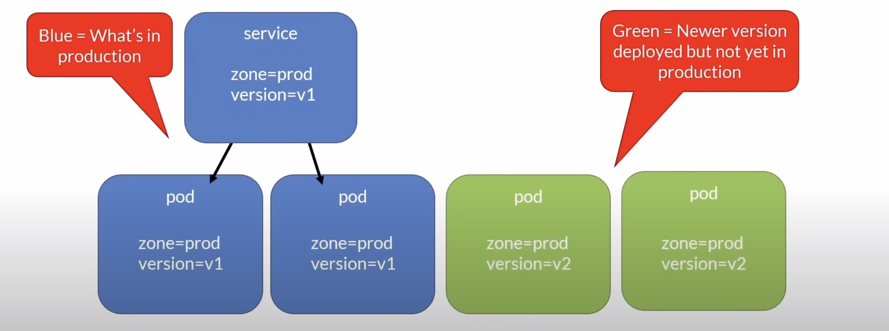
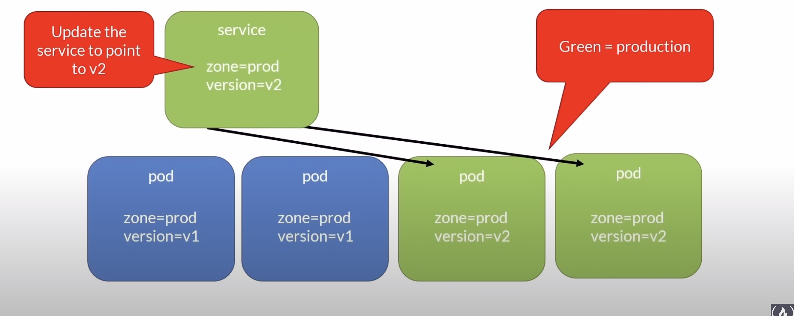

# Updates

## Rolling Updates

### Remember

Deployments
- replicas
  - Number of pod instances
- revisionHistoryLimit
  - Number of previous iterations to keep
- strategy
  - RollingUpdate : Cycle through updating pods
  - Recreate : All existing pods are killed before new ones are created

---

There are two values that you can set to help you with this process:

- maxSurge
  - Maximum number of Pods that can be created over the desired number of Pods
  - Value or percentage
- maxUnavailable
  - Maximum number of Pods that can be unavailable during the update
process
- Default strategy with maxSurge and maxUnavailable both set to 25%

### kubectl - Rolling Updates Cheat Sheet

```bash
# Update a deployment
kubectl apply -f [definition.yaml]

# Get the progress of the update
kubectl rollout status [deploymentname]

# Get the history of the deployment
kubectl rollout history deployment [deploymentname]

# Rollback a deployment
kubectl rollout undo [deploymentname]

# Rollback to a revision number
kubectl rollout undo [deploymentname] --to-revision=[revision#]
```

## Blue/Green Deployments




- Does not solve the new database schema problem entirely
- You need to over provision the cluster size

