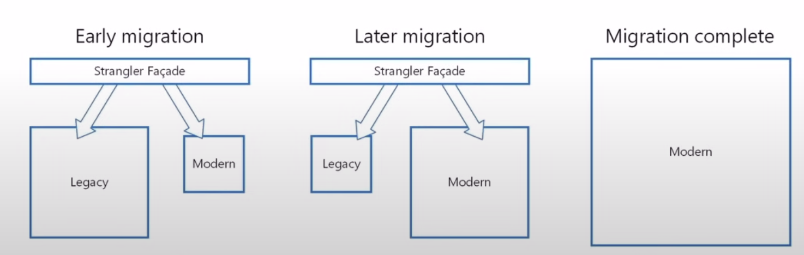

# Introduction to Microservice

### Microservices Architecture

A variant of the service-oriented architecture (SOA) structural style - arranges an application as a collection of loosely coupled services.
In a micro-services architecture, services are fine-grained and the protocols are lightweight.

### Monolithic Architecture

- Built as a single unit
- Deployed as a single unit
- Duplicated on each server

### From Monolith to Microservices

- Break your application/system in small units using [Strangler Pattern](https://martinfowler.com/bliki/StranglerFigApplication.html)

### Micro-services Anti Patterns (What can go wrong)

- Risk of unnecessary complexity
- Changes may impact numerous services
- Complex security

### Micro-services - Benefits

- Improved fault isolation
- Eliminate vendor or technology lock-in (because mostly open-source)
- Ease of understanding
- Smaller and faster deployments
- Scalability