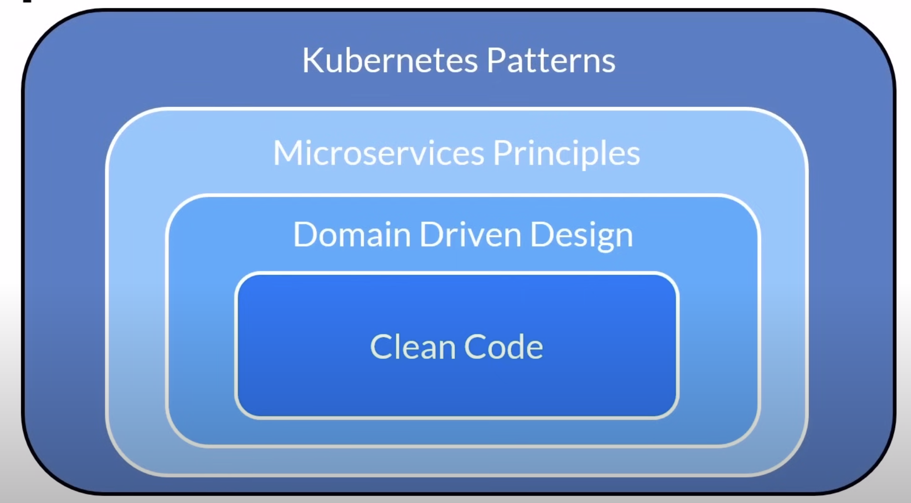

# Cloud Native

[Cloud native computing foundation](https://www.cncf.io/) (CNCF)

- [Look at the Sandbox, Incubating and Graduated projects](https://www.cncf.io/project-metrics/)
- [Cloud Native Trail Map](https://github.com/cncf/trailmap?tab=readme-ov-file#trail-map)
- [CNCF Cloud Native Interactive Landscape](https://landscape.cncf.io/)

Cloud native technologies empower organizations to build and run scalable applications in modern, dynamic environments such as public, private, and hybrid clouds. **Containers, service meshes, microservices, immutable infrastructure and declarative APIs** exemplify this approach.

These techniques enable **loosely coupled systems** (connected with APIs) that are **resilient, manageable and observable**. Combined with **robust automation**, they allow engineers to **make high-impact changes frequently** and predictably with minimal toil.

The Cloud Native Computing Foundation seeks to drive adoption of this paradigm by fostering and sustaining an **ecosystem of open source, vendor neutral projects**. We democratize state-of-the-art patterns to make these innovations accessible for everyone.

### Cloud Native Concepts

Speed and Agility

- Among many things, cloud native is about speed and agility
- Users want...
    - Instantaneous responsiveness
    - Up-to-the-minute features
    - No downtime
- The business wants...
    - Accelerated innovation
    - Rapid releases of features to meet disruption from competitors
    - Increased confidence - stability/performance

### Application Architecture

### Mentality: Pets vs Cattle

- Infrastructure becomes immutable and disposable
- Provisioned in minutes and destroyed on demand
- Never updated or repaired but re-provisioned

### Cloud Native Trail Map

- Breaks the journey into measurable objectives
- Achieve step 1 by December
- Set key performance indicators
- Measurable values