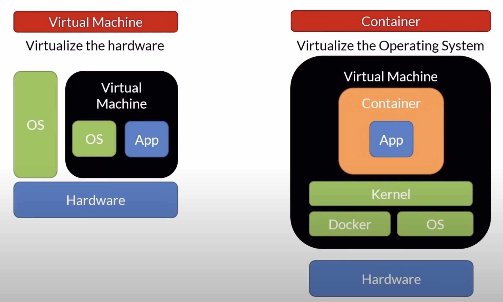

# Containers Concepts

A container is a unit of software/deployment

### Why containers?

- Move faster by deploying smaller units
- Use fewer resources
- Fit more into the same host
- Faster automation
- Portability
- Isolation

### VM vs Containers



| Virtual Machine | Container |
| --- | --- |
| Large footprint | Lightweight |
| Slow to boot | Quick to start (it does not have to boot) |
| Ideal for long running tasks | Ideal for short lived tasks |
|  | Portable |

```
⛔️ Containers are made of layers
```

### Container Registry

### Orchestrator

- Manage
    - Infrastructure
    - Containers
    - Deployment
    - Scaling
    - Failover
    - Health monitoring
    - App upgrades, Zero-Downtime deployments
- Install your own
    - Kubernetes, Swarm, Service Fabric
- Orchestrators as a service
    - Azure Kubernetes Service, Service Fabric

## What is Docker

- An open source container runtime
- Mac, Windows & Linux support
- Command line tool
- "Dockerfile" file format for building container images
- Windows let your run Windows and Linux containers

### Docker CLI Cheat Sheet - Management

```docker
docker info     # Display system information
docker version  # Display the system's version
docker login    # Log in to a Docker registry 
```

### Docker Desktop

- Make sure you signed in to your Docker account.
- Enable kubernetes
    - Click on the **Settings icon** (gear) in the top right of the window.
    - Select **Kubernetes**.
    - Check **Enable Kubernetes**.

### Docker CLI Cheat Sheet - Running Containers

```docker
docker pull [imageName]                            # Pull an image from a registry
docker run [imageName]                             # Run containers
docker run -d [imageName]                          # Detached mode
docker run --publish 80:80 --name webserver nginx  # pull and run an nginx server
docker start [containerName]                       # Start stopped containers
docker ps                                          # List running containers
docker ps -a                                       # List running and stopped containers
docker stop [containerName]                        # Stop containers
docker kill [containerName]                        # Kill containers
docker image inspect [imageName]                   # Get image info
docker rm [containerName]                          # remove the container
```

### Docker CLI Cheat Sheet - Limits

```docker
docker run --memory="256m" nginx  # Set a maximum memory limit for the container
docker run --cpus=".5" nginx      # Set a maximum CPU limit for the container
```

### Docker CLI Cheat Sheet - Attach Shell

```docker
docker run -it nginx -- /bin/bash                           # Attach shell to nginx container
docker run -it -- microsoft/powershell:nanoserver pwsh.exe  # Attach Powershell to a nanoserver container
docker container exec -it [containername] -- bash           # Attach to a running container's bash shell
```

### Docker CLI Cheat Sheet - Cleaning Up

```docker
docker rm [containerName]             # Removes stopped containers
docker rm $(docker ps -a -q)          # Removes all stopped containers
docker images                         # Lists images
docker rmi [imageName]                # Deletes the image
docker system prune -a                # Removes all images not in use by any containers
```

### Docker CLI Cheat Sheet - Building

```docker
docker build -t [name:tag] .             # Builds an image using a Dockerfile located in the same folder
docker build -t [name:tag] -f [fileName] # Builds an image using a Dockerfile located in a different folder
docker tag [imageName] [name:tag]        # Tag an existing image
```

### Docker CLI Cheat Sheet - Tagging

```docker
docker tag => Create a target image
  - name:tag
    - myimage:v1
  - repository/name:tag
    - myacr.azurecr.io/myimage:v1
```
