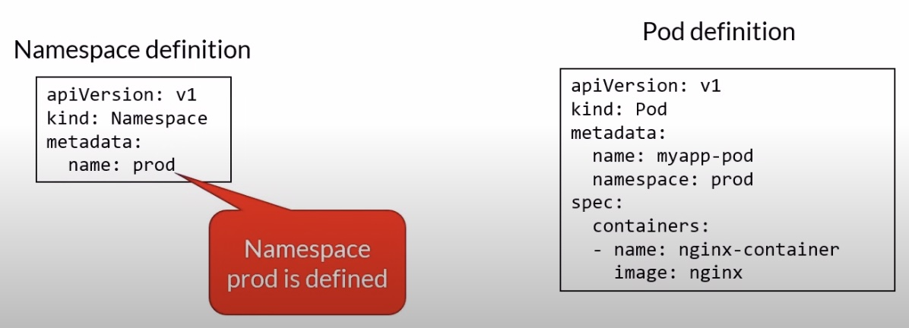

# Namespaces

- It's a kubernetes resource that allow you to group other resources. Ex. `dev`, `test`, `prod`.
- K8s creates a default workspace
- Objects in one namespace can access objects in a different one
  - Ex: objectname.prod.svc.cluster.local
- Deleting a namespace will delete all its child objects



- First we create a namespace.
- Above yaml file defines a namespace called `prod`.
- Then we use that namespace when we create other resources.
- In the metadata section we set the namespace key to the name of the namespace we want this resource to be created in (so `namespace: prod`).
- We can assign network policies and limit the resources that we can create in a namespace using the resource quota object.

### `kubectl` - Namespace Cheat Sheet

```bash
kubectl get namespace                                             # List all namespaces
kubectl get ns                                                    # Shortcut
kubectl config set-context --current --namespace=[namespaceName]  # Set the current context to use a namespace
kubectl create ns [namespaceName]                                 # Create a namespace
kubectl delete ns [namespaceName]                                 # Delete a namespace
kubectl get pods --all-namespaces                                 # List all pods in all namespaces
kubectl get pods -n [namespaceName]                               # List all pods in a namespace
```

