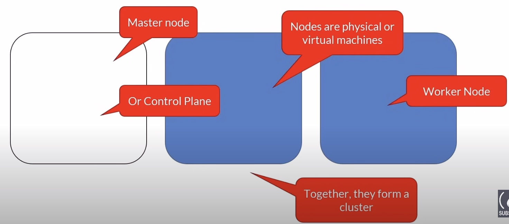
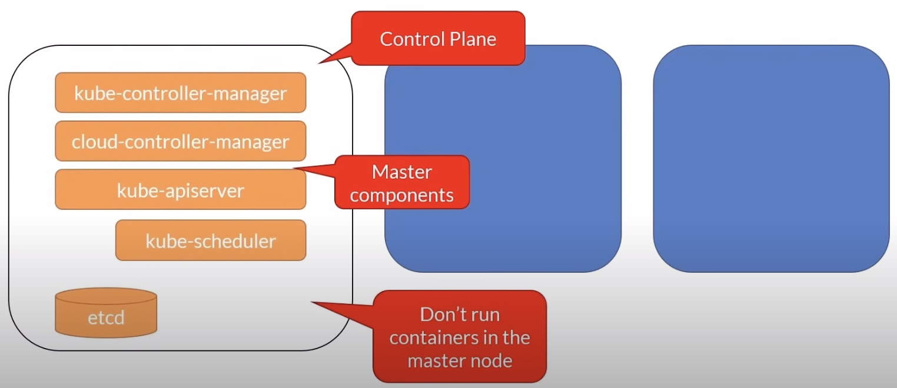
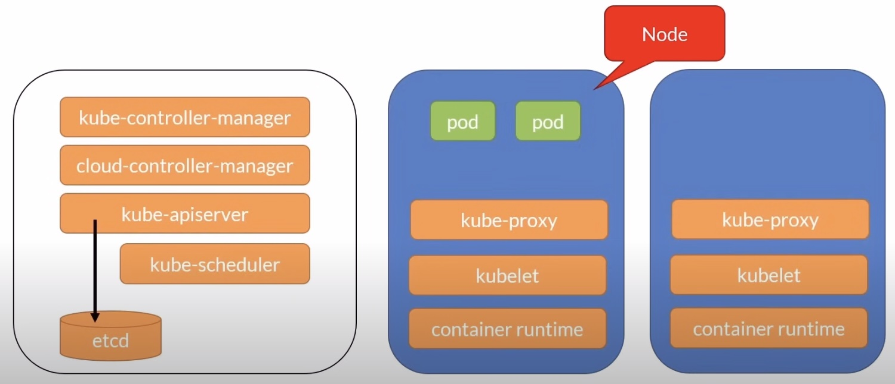

# Nodes

## Master Node



- Kubernetes services and controller are located on the control plane
- They are also called the master components



- `etcd` is a key-value data store that stores the state of the cluster
- The API Server (`kube-apiserver`) is the only component that interacts with `etcd`

### `kube-apiserver`

- It exposes a REST interface and client tools like the kubernetes CLI communicates through that API.
- Save state to the datastore (etcd)
- All clients interact with it, never directly to the datastore

### `etcd`

- Acts as a datastore for storing cluster state
- It's not a database but a key-value store
- It's the single source of truth inside the kube cluster

### `kube-control-manager`

- The controller of controllers!
- Runs other kube controllers
  - Node controller
  - Replication controller
  - Endpoints controller
  - Service account and Token controller

### `cloud-control-manager`

Interacts with the cloud providers controllers

- Node : For checking the cloud provider to determine if a node has been deleted in the cloud after it stops responding
- Route : For setting up routes in the underlying cloud infrastructure
- Service : For creating, updating and deleting cloud provider load balancers
- Volume : For creating, attaching, and mounting volumes, and interacting with the cloud provider to orchestrate volumes

### `kube-scheduler`

- Watches newly created pods that have no node assigned, and selects a node for them to run on
- Factors taken into account for scheduling decisions include
  - Individual and collective resource requirements
  - Hardware/software/policy constraints
  - Affinity and anti-affinity specifications
  - Data locality

### Addons

You can install various add-ons on the masternode these add-ons provide additional functionalities in your kubernetes cluster.

- DNS
- Web UI (dashboard)
- Cluster-level logging
- Container resource monitoring

## Worker Nodes

- A node is a physical or virtual machine
- A group of nodes forms a cluster 
- There's a special node called the masternode, it's sometimes called the control plane where the kubernetes services are installed
- The nodes running the containers are called the worker nodes



- When a worker node is added to the cluster some kubernetes services are installed automatically
- These are services necessary to run pods and they are managed by the master components on the masternode

### `kubelet`

- Manage the pods lifecycle
- Ensures that the containers described in the Pod specs are running and healthy

### `kube-proxy`

- A network proxy
- Manages network rules on nodes

### Container runtime

- K8s supports several container runtimes
- Must implement the Kubernetes Container Runtime Interface
  - Moby
  - Containerd
  - Cri-O
  - Rkt
  - Kata
  - Virtlet

**Note :** Container runtime - K8s V1.19+

- Docker images run as is. It's business as usual!
- What's changed is what you can do inside the cluster
  - You can no longer access the Docker engine inside the cluster
  - Docker commands won't run if you ssh into a node
  - Use crictl instead

### Nodes pool

- A node pool is a group virtual machines, all with the same size
- A cluster can have multiple node pools
  - These pools can host different sizes of VMs
  - Each pool can be autoscaled independently from the other pools
- Docker Desktop is limited to 1 node

## CLI Cheat Sheet

```bash
# Get a list of all the installed nodes. Using Docker Desktop, there should be only one.
kubectl get nodes

# Get some info about the node.
kubectl describe node
```
