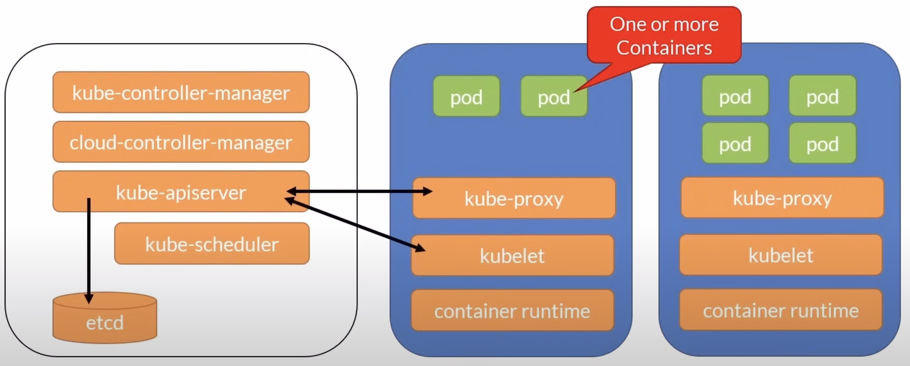
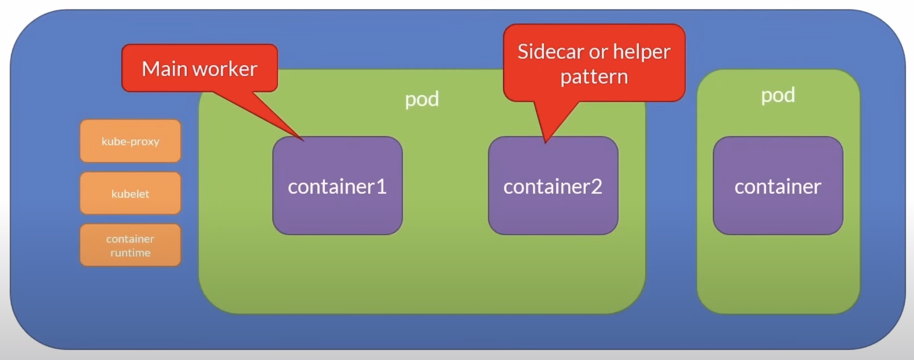
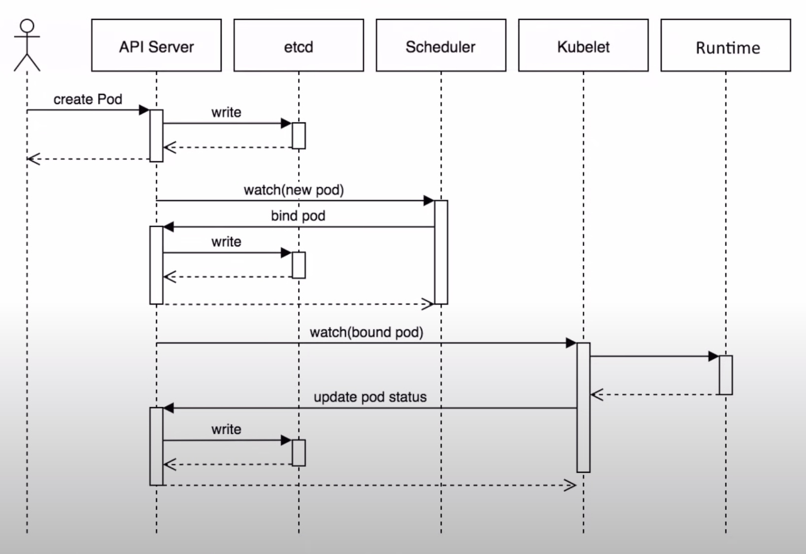
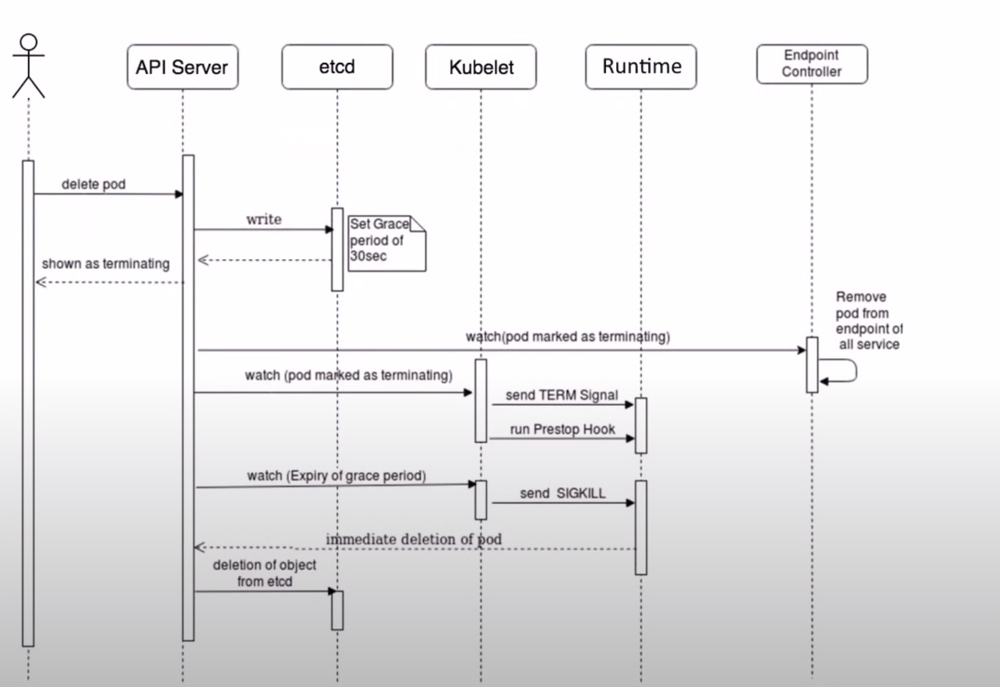
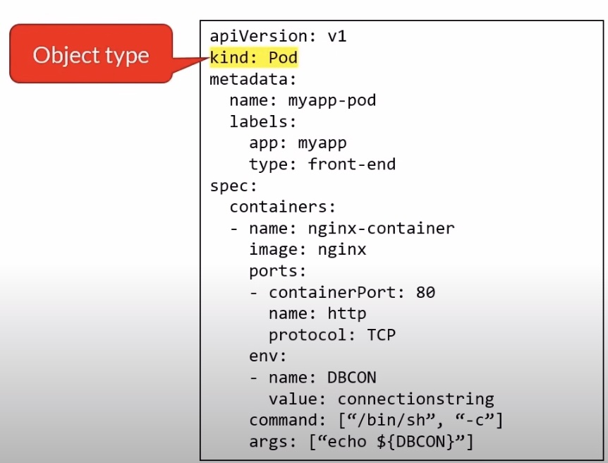

# Pods

- Atomic unit of the smallest unit of work of K&s
- Encapsulates an application's container
- Represents a unit of deployment
- Pods can run one or multiple containers
- Containers within a pod share
  - IP address space, mounted volumes
- Containers within a pod can communicate via
  - Localhost, IPC
- Pods are ephemeral
- Deploying a pod is an atomic operation, it succeed or not
- If a pod fails, it is replaced with a new one with a shiny new IP address
- You don't update a pod, you replace it with an updated version
- You scale by adding more pods, not more containers in a pod





## Pod Lifecycle

### Pod Creation



- When we issue a `kubectl create` command to deploy a pod in our cluster, the CLI sends the information to the API server
- That information will be written into `etcd`
- The scheduler will watch for this type of information, look at the nodes and find one where to schedule the pod and write that information in `etcd`
- The `kubelet` running on the node will watch for that information and issue a command to create an instance of the container inside a pod
- Finally the status will be written in `etcd`

### Pod Deletion



- When you issue a `kubectl delete` command to delete a pod from your cluster the CLI sends the information to the API server
- That information will be written in `etcd` and notice that the grace period of 30 seconds will be added
- So the `kubelet` picks that information and sends a terminate signal to the container
- If the container hangs it is killed after the 30 seconds grace period
- And finally the state is stored in `etcd`

### Pod State

- Pending : Accepted but not yet created
- Running : Bound to a node
- Succeeded : Exited with status 0
- Failed : All containers exit and at least one exited with non-zero status
- Unknow : Communication issues with the pod
- CrashLoopBackOff : Started, crashed, started again, and then crashed again

## Defining and Running Pods




- To define a pod the declarative way you create a yaml file, specifiyin `Pod` as the kind, that's the type of resource we want to create
- We specify an image location, in this case the nginx image will be pulled from Docker Hub, that's the default container registry
- We set the port that the container will listen on
- We can add labels, they are used to identify, describe and group related sets of objects and resources
- We can set environment variables directly here, might not be the best idea to place configuration values in a later lecture we'll see how we can externalize that by the use of a config map object
- We can even specify a command to run when the container starts

### kubectl - Pod Cheat Sheet

```bash
# Create a pod
kubectl create -f pod-definition.yaml

# Run a pod
kubectl run [podname] --image=busybox -- /bin/sh -c "sleep 3600"

# List the running pods
kubectl get pods

# Same but with more info
kubectl get pods -o wide

# Show pod info
kubectl describe pod [podname]

# Extract the pod definition in YAML and save it to a file
kubectl get pod [podname] -o yaml > file.yaml

# Interactive mode
kubectl exec -it [podname] -- sh

# Delete a pod
kubectl delete -f pod-definition.yaml

# Same using the pod's name
kubectl delete pod [podname]
```

See [L21-04](https://github.com/K8sAcademy/Fundamentals-HandsOn/blob/main/L21-04%20Pods/Readme.md) for more details.

## Init Containers

- Let's say that your app has a dependency on something can be a database an API or some config files you want to initialize or validate that these exist before launching the app
- But you don't want to clutter your main logic with this type of infrastructure code
- So what do you do you can use an init container that lets you initialize a pod before an application container runs
- Let's say that for the app container to run it requires a series of configuration files in the Pod definition
- You define a container that will run first
- This is the init container
- Upon completion kubernetes will start the app container
- This is a great pattern for applications that have dependencies the init container job can be as simple as validating that a service or a database is up and running this keeps the infrastructure code out of the main logic

- They always run to completion
- Each init container must complete successfully before the next one starts
- If it fails, the kubelet repeatedly restarts it until it succeeds
  - Unless it's restartPolicy is set to Never
- Probes are not supported
  - livenessProbe, readinessProbe, or startupProbe

See [L21-06](https://github.com/K8sAcademy/Fundamentals-HandsOn/blob/main/L21-05%20Init%20Containers/Readme.md) for more details.