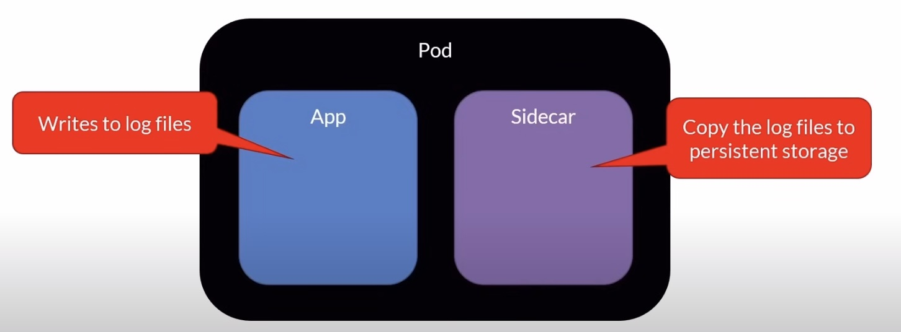
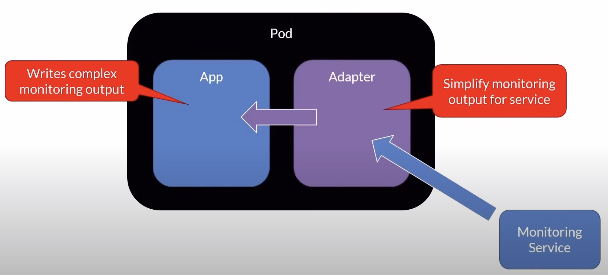
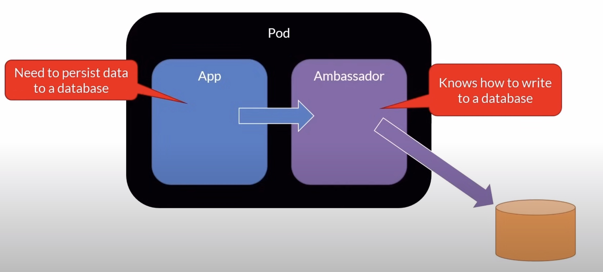
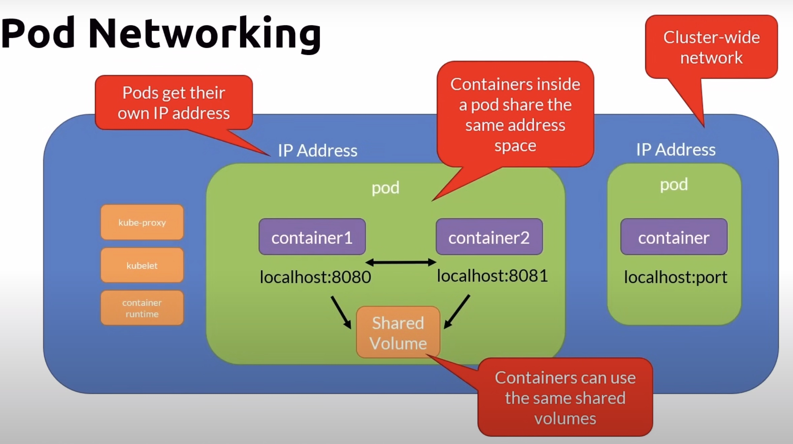
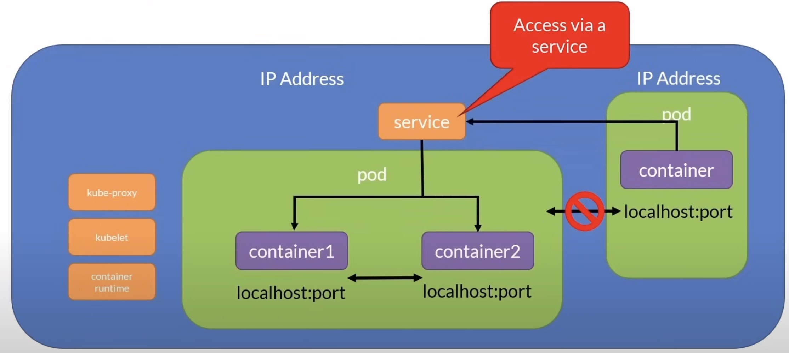
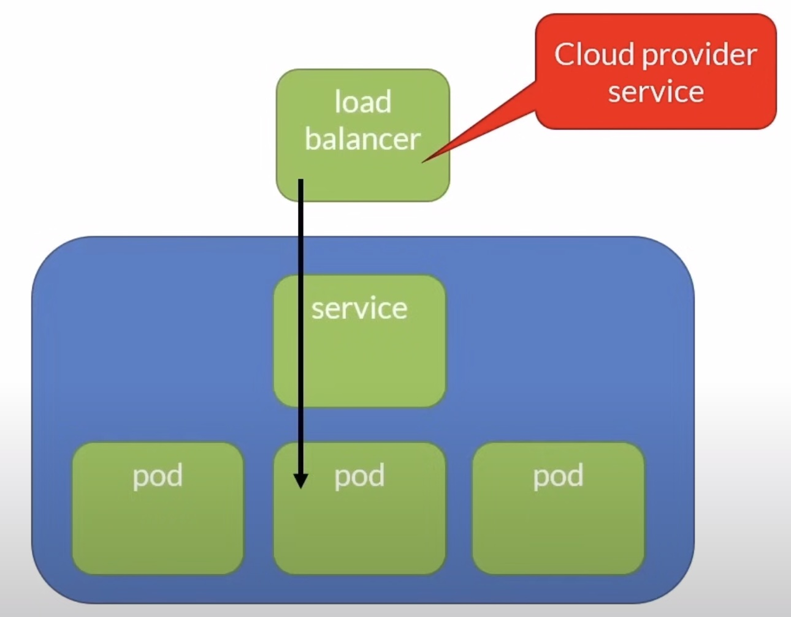

# Multi-Container Pods

Most common scenario: Helper processes

### Typical Patterns - Sidecar



- The helper container provides extra functionalities to the main worker
- Let's say that our app writes some log files inside the pod
- The sidecar can copy these log files to some persistent storage offered by the cloud provider
- This way the application code located inside the main worker is not cluttered with infrastructure code
- That code is located in the helper container
- If you move from one cloud provider to another one, you simply replace or update that helper code
- This keeps your application code super clean


### Typical Patterns - Adapter



- Let's say that our main worker outputs some complex monitoring information that the monitoring surface of our cloud provider cannot understand
- The adapter role would be to connect to the main worker, simplify the data for the monitoring service
- Again, the code specific to the cloud provider service is located inside the helper container

### Typical Patterns - Ambassador



- The Ambassador pattern is another type of the middle role
- Let's say that our application code needs to write to some NoSQL database but the code has no clue on how to do that
- No problem, you can send that data to the Ambassador that in turn will write the data to the NoSQL data store
- The code specific to the data store service is located inside the helper container

### kubectl - Pod Cheat Sheet

```bash
# Create a pod
kubectl create -f pod-definition.yaml

# Exec into a pod
kubectl exec -it myapp-pod -c simple-webapp -- sh

# Get the logs for a container
kubectl logs myapp-pod -c simple-webapp
```

## Networking Concepts

### Pod Networking

- All containers within a pod can communicate with each other
- All pods can communicate with each other
- All nodes can communicate with all pods
- Pods are given an IP address (ephemeral)
- Services are given a persistent IP



### Interpod Networking



### Externak Access



---

See [L23-03](https://github.com/K8sAcademy/Fundamentals-HandsOn/blob/main/L23-03%20Multi%20Containers%20Pods/Readme.md) for more details.

