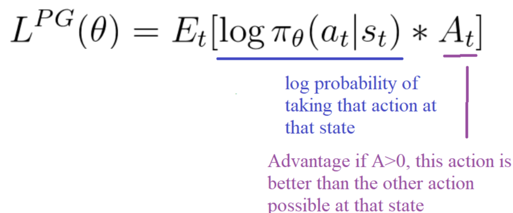
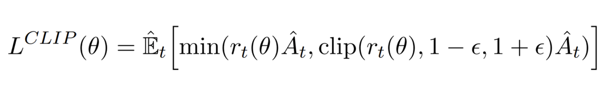
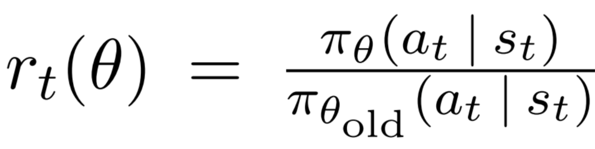
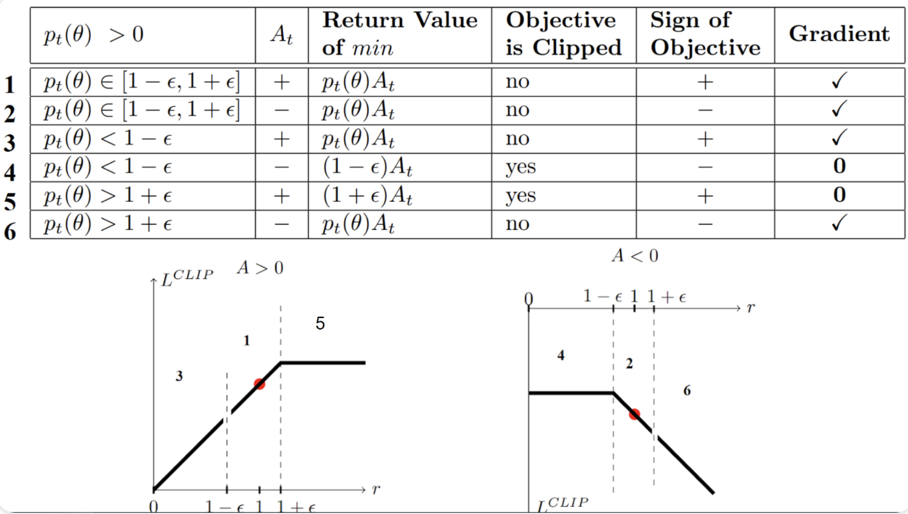

# PPO : Proximal Policy Optimization

## Deepmind's DQN : Deep Q-Network (2014)

- Unstable
  - It's an offline method, i.e. it learns from previous policies. (So you are updating the policy with the data that is not from your policy)
  - It uses value bootstrapping.

## TRPO : Trust Region Policy Optimization (2015)

- Alternative policy update method, which is an optimization function, which is subjected to a constraint.
- Constraint is KL-divergence between old network and new network.
- One big issue with TRPO is it's complicated.

## PPO : Proximal Policy Optimization (2017)

- Easier to understand & implement
- Conservative rewards & unlimited penalties
- Remember the Policy Objective Function for RL:

- With PPO, the idea is to constrain our policy update with a new objective function called the "Clipped surrogate objective function" that will constrain the policy change in a small range using a clip.

- The ratio function is calculated as follows:

- It’s the probability of taking action $a_t$ at state $s_t$ in the current policy, divided by the same for the previous policy.
- By clipping the ratio, we ensure that we do not have a too large policy update because the current policy can’t be too different from the older one.

## Hands-on

[PPO Hands-on](https://huggingface.co/learn/deep-rl-course/unit8/hands-on-sf)

## References

- [OpenAI Blog](https://openai.com/index/openai-baselines-ppo)
- [Paper : Proximal Policy Optimization Algorithms](https://arxiv.org/pdf/1707.06347)
- [Hugginface DeepRL Course](https://huggingface.co/learn/deep-rl-course/unit8/introduction)
- [Proximal Policy Optimization Explained](https://youtu.be/HrapVFNBN64)

---

- [Let's Code Proximal Policy Optimization](https://youtu.be/HR8kQMTO8bk)
