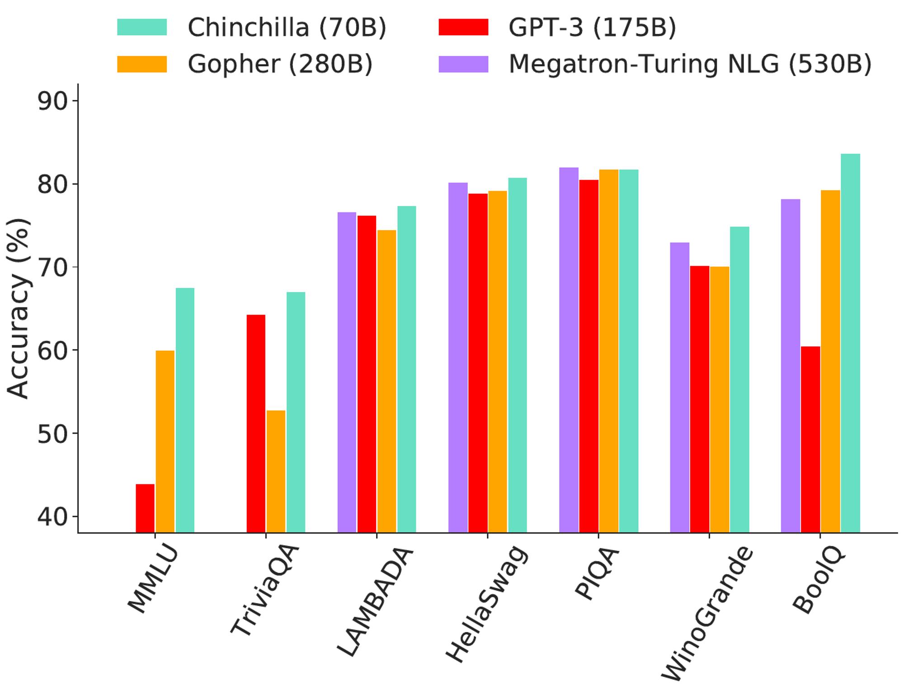

# Training Compute Optimal LLMs

### Training Compute-Optimal Large Language Models

#### 1. Introduction

#### 2. Related Work

**Large language models**

**Modeling the scaling behavior**

**Estimating the hyper parameters of large models**

**Improved Model Architectures**

#### 3. Estimating the optimal parameter/training tokens allocation

**3.1. Approach 1: Fix model sizes and vary number of training tokens**

**3.2. Approach 2: IsoFLOP profiles**

**3.3. Approach 3: Fitting a parametric loss function**

**3.4. Optimal model scaling**

#### 4. Chinchilla

**4.1. Model and training details**

**4.2. Results**

4.2.1. Language modelling

4.2.2. MMLU

4.2.3. Reading comprehension

4.2.4. BIG-bench

4.2.5. Common sense

4.2.6. Closed-book question answering

4.2.7. Gender bias and toxicity

#### 5. Discussion & Conclusion

#### 6. Acknowledgements

> We investigate the optimal model size and number of tokens for training a transformer language model under a given compute budget.
> 

Compute budget is determined prior to the experiment, measured with FLOPs (or TFLOPs).

### Current LLMs are undertrained

> We find that current large language models are significantly undertrained.
> 

> We find that for compute-optimal training, the model size and the number of training tokens should be scaled equally.
> 

> We test this hypothesis by training a predicted compute-optimal model, Chinchilla, that uses the same compute budget as Gopher (280B) but with 70B (4x smaller model) parameters and 4× more more data.
> 

> This also means that Chinchilla uses substantially less compute for fine-tuning and inference, greatly facilitating downstream usage.
> 

### Kaplan et al. (2020)

> Kaplan et al. (2020) showed that there is a power law relationship between the number of
parameters in an autoregressive language model (LM) and its performance (measured with loss).
> 

> One notable conclusion in Kaplan et al. (2020) is that large models should not be trained to their lowest possible loss to be compute optimal.
> 

> Whilst we reach the same conclusion, we estimate that large models should be trained for many more training tokens than recommended by the authors.
> 

Claim is : no parameters and no training tokens should be scaled equally. (Kaplan et al. claims 5.5x & 1.8x respectively.)

### Aim

Given a fixed compute budget $(C = FLOPs(N,D))$, minimize the final pre-training loss $L(N,D)$ where $N$ is the no parameters (model size) and $L$ is the no training tokens.

> Our approach leads to considerably different results than that of Kaplan et al. (2020)
> 

I guess this is normal because Kaplan et al. doesn’t train to the lowest loss.

### Gopher vs Chinchilla

They used same compute budget with Gopher

|  | Gopher | Chinchilla |
| --- | --- | --- |
| No training tokens | 300b | 1.4t |
| No parameters | 280b | 70b |

---

> We find that larger, high quality datasets will play a key role in any further scaling of language models.
> 

I guess this is the challenge anyways.

### Kaplan et al. (2020) vs this paper

1st difference

> In Kaplan et al., the authors use a fixed number of training tokens and learning rate schedule for all models; this prevents them from modeling the impact of these hyper-parameters on the loss.
> 

> In contrast, we find that setting the learning rate schedule to approximately match the number of training tokens results in the best final loss regardless of model size.
> 

> For a fixed lr cosine schedule to 130b, intermediate loss estimates $(D^{'} << 130b)$ are overestimates of a model trained with a schedule length matching $D^{'}$.
> 

> Using these intermediate losses results in the conclusion that model size should increase faster than training data size as compute budget increases.
> 

2nd difference

> We include models with up to 16B parameters, as we observe that there is slight
curvature in the FLOP-loss frontier; in fact, the majority of the models used in our analysis have more than 500 million parameters, in contrast the majority of runs in Kaplan et al. are significantly smaller, many being less than 100M parameters.
> 

### Remember the objective

> Given a fixed FLOPs budget, how should one trade-off model size and the number of training tokens?
> 

They used 3 different approaches to answer this question.

### 1. Minimum over training curves

Fix model sizes and vary number of training tokens. 

For each parameter count N we train 4 different models (4 different number of training sequences.)

### 2. IsoFLOP profiles

We vary the model size for a fixed set of 9 different training FLOP counts.

consider the final training loss for each point (in contrast with Approach 1 that considered points $(N,D,L)$ along the entire training runs.)

### 3. Fitting a parametric loss function

We model all final losses from experiments in Approach 1 & 2 as a parametric function of
model parameter count and the number of seen tokens.

---

They discover that despite employing various fitting procedures and trained models, the three approaches produce comparable predictions for the ideal scaling in parameters and tokens with FLOPs. According to all three approaches, the model size and the amount of training data should grow in roughly equal amounts as the compute budget increases.

The article presents a hypothesis that the optimal model size for the Gopher computes budget is between 40 and 70 billion parameters, and tests this by training a model on the larger end of this range, called Chinchilla, with 70B parameters and 1.4T tokens. They compared this model to Gopher and other large language models (LLMs). Both Chinchilla and Gopher have been trained for the same number of FLOPs but differ in the size of the model and the number of training tokens. Chinchilla is smaller than Gopher (4x), which leads to a lower memory footprint and inference cost.

For various common benchmarks that include Question Answering (TriviaQA), CommonSense (HellaSwag, PIQA, Winogrande, and BoolQ), Reading Comprehension (LAMBADA), and the large Multi-task Language Understanding (MMLU) general knowledge benchmark, they compare the performance of Gopher, Chinchilla*,* GPT-3, and Megatron-Turing NLG. You can see the results in the following picture:

In conclusion, the experiments conducted in this article demonstrate that Chinchilla, a large language model with 70 billion parameters and 1.4T tokens, outperforms Gopher, GPT-3, Jurassic-1, and Megatron-Turing NLG on a range of downstream evaluation tasks. This suggests that the optimal model size for the Gopher compute budget is somewhere between 40 and 70 billion parameters and that increasing both the model size and the number of training tokens in approximately equal proportions leads to better performance. Additionally, Chinchilla uses substantially less computation for fine-tuning and inference, greatly facilitating downstream usage.

# References

1. Kaplan et al. (2020) : Scaling laws for neural language models [arXiv:2001.08361](https://arxiv.org/abs/2001.08361)
2. [Training Compute-Optimal Large Language Models](https://arxiv.org/abs/2203.15556)
