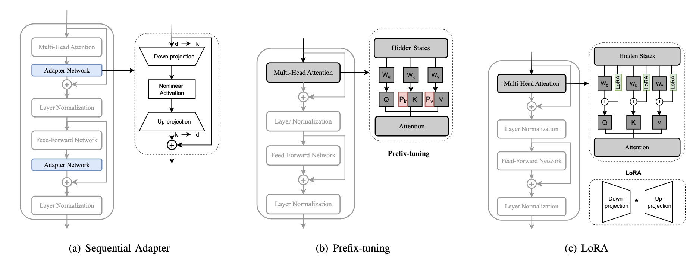

# Parameter-Efficient Fine-Tuning Methods for Pretrained Language Models: A Critical Review and Assessment

## Introduction

This paper reviews Parameter Efficient Fine-Tuning (PEFT) methods for large pretrained language models (PLMs), focusing on their utility in resource-constrained settings. The review covers various PEFT methods, their applications, and future prospects, and includes experiments evaluating their efficiency, providing key insights for researchers and practitioners in the field.

**Some advantages of PEFT compared to full fine-tuning :**

- It doesn't necessitate substantial computational resources and labeled data, as the model isn't trained from scratch.
- As it selectively updates minimal parameters, it maintains base PLM knowledge and reduces catastrophic forgetting in target tasks.
- It avoids overfitting by selectively updating (or not updating) pretrained parameters.

**Main contributions of the paper :**

- They present a comprehensive analysis and review of PEFT methods for transformer-based PLMs
- They classify PEFT methods into 5 categories (additive, partial, reparameterized, hybrid, and unified) by identifying the key techniques employed in PEFT methods.
- They conduct quantitative investigations and analyses to assess the *performance*, *parameters efficiency*, and *memory usage* of these PEFT approaches. (They focus on natural language understanding (NLU), machine translation (MT), and natural language generation (NLG) tasks)
- They explore the applications of PEFT in multi-task learning, cross-lingual transfer, and backdoor attack and defense, underscoring its effectiveness.

## PEFT Methods

Paper provides a figure that categorizes each PEFT method, I put here a simpler version of it for ones who are not interested in all of the details.

| Main Category                 | Subcategories                   | Examples                               |
|-------------------------------|---------------------------------|----------------------------------------|
| Additive Fine-tuning          | Adapter-based Fine-tuning       | Sequential Adapter, Residual Adapter   |
| .                             | Soft Prompt-based Fine-tuning   | WARP, Promt-tuning, Prefix-tuning      |
| .                             | Others                          | LST, IA, PASTA, AttentionFusion        |
| Partial Fine-tuning           | Bias Update                     | BitFit                                 |
| .                             | Pretrained Weight Masking       | Threshold-Mask                         |
| .                             | Delta Weight Masking            | LT-SFT                                 |
| Reparameterized Fine-tuning   | Low-rank Decomposition          | LoRA                                   |
| .                             | LoRA Derivatives                | Low-rank Adjustment, LoRA-guided Pretrained Weight Update, Quantization Adaption, LoRA-based Improvements, LoRA-based Multi-task Fine-tuning|
| Hybrid Fine-tuning            | Manual Combination              | MAM Adapter                            |
| .                             | Automatic Combination           | AutoPEFT                               |
| Unified Fine-tuning           |                                 | AdaMix, SparseAdapter                  |

 

I also put the descriptions of these main categories in a table for easier comparison.

| Main Category                 | Description                                                                                           |
|-------------------------------|-------------------------------------------------------------------------------------------------------|
| Additive Fine-tuning          |The methods introduce new extra trainable parameters for task-specific fine-tuning                     |
| Partial Fine-tuning           | Only a subset of model's parameters are updated, reducing computational load                          |
| Reparameterized Fine-tuning   | Modify the architecture to be more parameter-efficient through techniques like low-rank factorization |
| Hybrid Fine-tuning            | Combine different PEFT techniques for more efficient fine-tuning                                      |
| Unified Fine-tuning           | Integrate various PEFT strategies into a single coherent approach                                     |

 

### 1. Additive Fine-tuning

| Subcategory                   | Description                                                                         |
|-------------------------------|-------------------------------------------------------------------------------------|
| Adapters-based Fine-tuning    | Introduce modules that learn task-specific adaptations without altering base model  |
| Soft Prompt-based Fine-tuning | Insert trainable vectors (prompts) into the input sequence for task adaptation      |
| Others                        | Include various other methods that add parameters like bias terms or small networks |

### 2. Partial Fine-tuning

| Subcategory               | Description                                                                                                          |
|---------------------------|----------------------------------------------------------------------------------------------------------------------|
| Bias Update               | Only the bias term in the attention layer, feed-forward layer and layer normalization of the transformer is updated  |
| Pretrained Weight Masking | The pretrained weights are masked using various pruning criterion                                                    |
| Others                    | Delta weights are masked via pruning techniques and optimization approxima- tion.                                    |

### 3. Reparameterized Fine-tuning

| Subcategory            | Description                                                                                |
|------------------------|------------------------------------------------------------------------------------------- |
| Low-rank Decomposition | Various low-rank decomposition tech- niques are used to reparameterize the updated matrix  |
| LoRA derivatives       | A series of PEFT methods are developed based on LoRA                                       |

### 4. Hybrid Fine-tuning

| Subcategory            | Description                                                                                |
|------------------------|------------------------------------------------------------------------------------------- |
| Mannual Combination    | Multiple PEFT methods are combined manually by sophisticated design                        |
| Automatic Combination  | Where various PEFT methods are incorporated automatically via structure search             |

## References

- [Parameter-Efficient Fine-Tuning Methods for Pretrained Language Models: A Critical Review and Assessment](https://arxiv.org/pdf/2312.12148.pdf)
