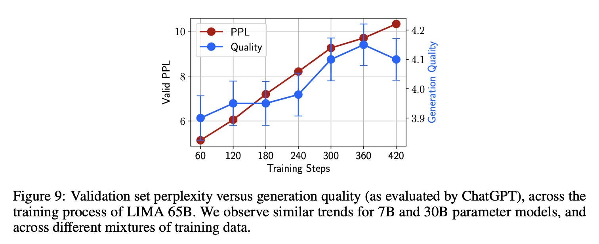

# LIMA: Less Is More for Alignment

Almost all knowledge in large language models is learned during pretraining, and only limited instruction tuning data is necessary to teach models to produce high quality output.

LIMA produces equal or preferrable responses in 43%, 46%, and 58% of the cases, respectively.

Specifically, many prompts will be answered with some acknowledgment of the question followed by the answer itself.

Starting from LLaMa 65B [Touvron et al., 2023], we fine-tune on our 1,000-example alignment training set.

**Experiment Setup** We fine-tune a 7B parameter LLaMa model Touvron et al. [2023] on various
datasets,controllingforthesamehyperparameters(Section3).5 Wethensample5responsesfor
each test set prompt, and evaluate response quality by asking ChatGPT (GPT-3.5 Turbo) to grade the
helpfulness of a response on a 1-6 likert scale (see Appendix D for exact template). We report the
average score alongside a *𝑝* = 0*.*95 two-sided confidence interval.

**Anticorrelation between Perplexity and Generation Quality**

When fine-tuning LIMA, we observe that perplexity on held-out Stack Exchange data (2,000 examples) negatively correlates with the model’s ability to produce quality responses. To quantify this manual observation, we evaluate model generations using ChatGPT, following the methodology described in Section 5. Figure 9 shows that as perplexity rises with more training steps – which is typically a negative sign that the model is overfitting – so does the quality of generations increase. Lacking an intrinsic evaluation method, we thus resort to manual checkpoint selection using a small 50-example validation set.

