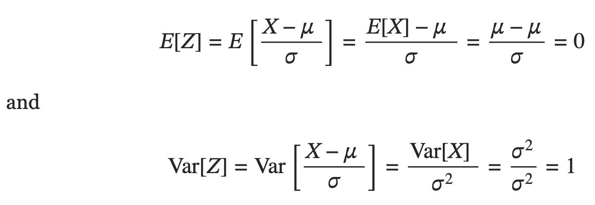
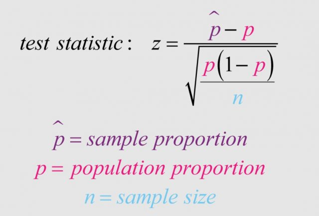

# z-score

$$Z = \frac{X - \mu}{\sigma}$$

z-score answers the following question : Is there a difference between the sample proportion (hypothesized) and population proportion (theoretical)?

How much standard deviation I am away from the mean?

## Derivation

Linearity of expectation

$$ E[aX+b] = aE[X] + b $$

Variance property

$$ Var[aX+b] = a^2Var[X] $$

Applying these formulas, if $X$ is a normal random variable with mean $\mu$ and variance $\sigma^2$, and $Z = (X - \mu)/\sigma$, then;

Therefore, $Z$ has mean 0 and variance 1. Also we know that linear transformation of a normal random variable is still normal, therefore $Z$ is standard normal distribution.

## One proportion z-test

## References

- [How is the denominator in one sample Z test of proportion derived?](https://stats.stackexchange.com/questions/573048/how-is-the-denominator-in-one-sample-z-test-of-proportion-derived)
- [What is the idea behind the derivation of z-score formula?](https://math.stackexchange.com/questions/3777210/what-is-the-idea-behind-the-derivation-of-z-score-formula)
