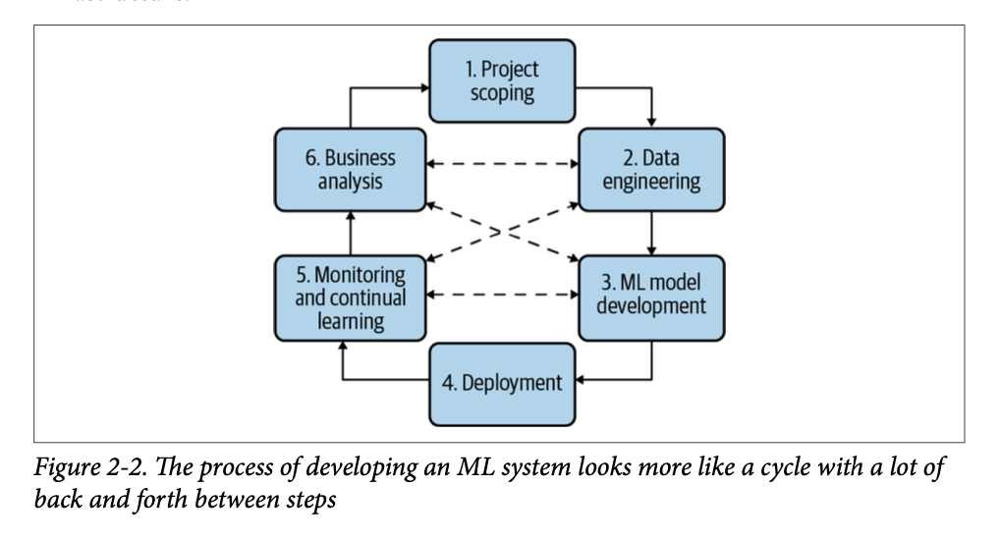

# ML System Design

## Ch2 - Introduction to Machine Learning Systems Design

### 2.1 - Iterative Process

#### Step 1. Project scoping

A project starts with scoping the project, laying out goals, objectives, and con-straints. Stakeholders should be identified and involved. Resources should be estimated and allocated. We already discussed different stakeholders and some of the foci for ML projects in production in Chapter 1. We also already discussed how to scope an ML project in the context of a business earlier in this chapter. We'll discuss how to organize teams to ensure the success of an ML project in Chapter 11.

#### Step 2. Data engineering

A vast majority of ML models today learn from data, so developing ML models starts with engineering data. In Chapter 3, we'll discuss the fundamentals of data engineering, which covers handling data from different sources and formats. With access to raw data, we'll want to curate training data out of it by sampling and generating labels, which is discussed in Chapter 4.

#### Step 3. ML model development

With the initial set of training data, we'll need to extract features and develop initial models leveraging these features. This is the stage that requires the most ML knowledge and is most often covered in ML courses. In Chapter 5, we'll discuss feature engineering. In Chapter 6, we'll discuss model selection, training, and evaluation.

#### Step 4. Deployment

After a model is developed, it needs to be made accessible to users. Developing an ML system is like writing-you will never reach the point when your system is done. But you do reach the point when you have to put your system out there. We'll discuss different ways to deploy an ML model in Chapter 7.

#### Step 5. Monitoring and continual learning

Once in production, models need to be monitored for performance decay and maintained to be adaptive to changing environments and changing requirements.
This step will be discussed in Chapters 8 and 9.

#### Step 6. Business analysis

Model performance needs to be evaluated against business goals and analyzed to generate business insights. These insights can then be used to eliminate unproductive projects or scope out new projects. This step is closely related to the first step.

# Ch3 - Data Engineering Fundamentals

## 3.1 Data Storage Engines and Processing

### 3.1.1 Transactional and Analytical Processing

Transactional databases are designed to process online transactions and satisfy the low latency, high availability requirements. When people hear transactional data-bases, they usually think of ACID (atomicity, consistency, isolation, durability). Here are their definitions for those needing a quick reminder:

#### Atomicity
To guarantee that all the steps in a transaction are completed successfully as a group. If any step in the transaction fails, all other steps must fail also. For example, if a user's payment fails, you don't want to still assign a driver to that user.

#### Consistency

To guarantee that all the transactions coming through must follow predefined rules. For example, a transaction must be made by a valid user.

#### Isolation

To guarantee that two transactions happen at the same time as if they were isolated. Two users accessing the same data won't change it at the same time. For example, you don't want two users to book the same driver at the same time.

#### Durability

To guarantee that once a transaction has been committed, it will remain committed even in the case of a system failure. For example, after you've ordered a ride and your phone dies, you still want your ride to come.

However, transactional databases don't necessarily need to be ACID, and some developers find ACID to be too restrictive. According to Martin Kleppmann, "systems that do not meet the ACID criteria are sometimes called BASE, which stands for Basically Available, Soft state, and Eventual consistency. This is even more vague than the definition of ACID."20